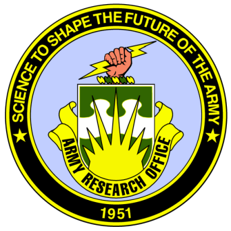
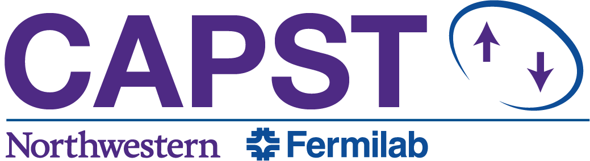

.. scqubits
   Copyright (C) 2019, Jens Koch & Peter Groszkowski

.. _acknowledgments:

***********************
Funding Acknowledgments
***********************

Development of the scqubits library was partially supported by the Army Research Office under Grant no. W911NF-15-1-0421,
by Northwestern University, and by Northwestern's Center for Applied Physics and Superconducting Technologies.

|

.. figure:: graphics/NU-logo.png
   :align: center
   :width: 2.0in
   :target: https://www.northwestern.edu

|

[//]: # (TODO: update CAPST URL)