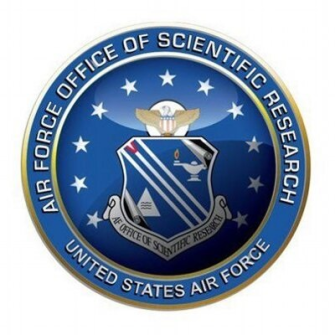

.. scqubits
   Copyright (C) 2019, Jens Koch & Peter Groszkowski

.. _acknowledgments:

***********************
Funding Acknowledgments
***********************

We gratefully acknowledge financial support for the continued development of the scqubits library by the Air Force
Office for Scientific Research under grant no. FA9550-20-1-0271. Previously, creation of the scqubits library was
partially supported by the Army Research Office under Grant no. W911NF-15-1-0421, by Northwestern University, and by
the Northwestern-Fermilab Center for Applied Physics and Superconducting Technologies (CAPST).

|

.. figure:: graphics/aro.png
   :align: center
   :width: 1.5in
   :target: https://www.aro.army.mil

|

.. figure:: graphics/NU-logo.png
   :align: center
   :width: 2.0in
   :target: https://www.northwestern.edu

|

.. figure:: graphics/CAPST.png
   :align: center
   :width: 2.5in
   :target: https://capst.northwestern.edu/
