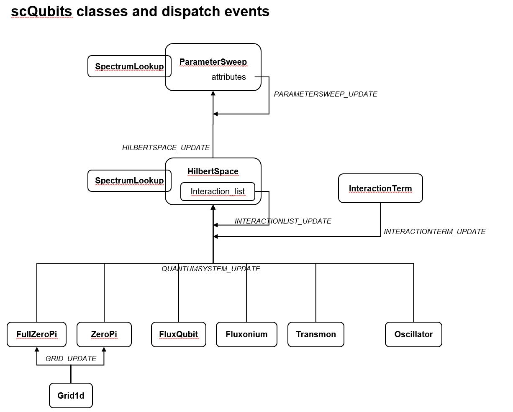
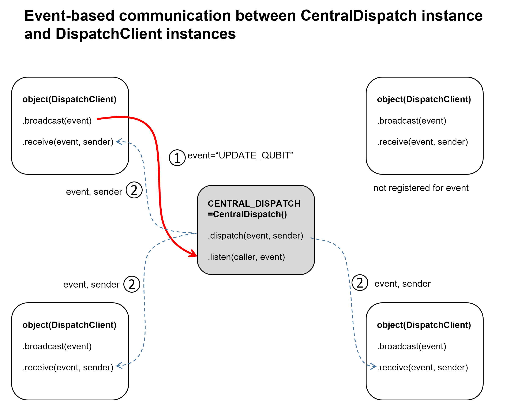
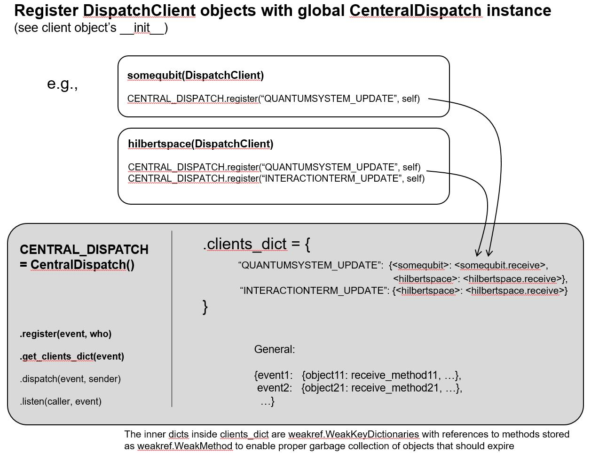

.. scqubits
   Copyright (C) 2017 and later, Jens Koch & Peter Groszkowski

.. _developerclasses:

===============================
For Developers
===============================

The following classes are mainly of interest for developers.

*******************************
Qubit base classes
*******************************

.. _classes-qubitbase:

.. autoclass:: scqubits.core.qubit_base.QubitBaseClass
    :members:

.. autoclass:: scqubits.core.qubit_base.QubitBaseClass1d
    :members:

**********************************************************
CentralDispatch and related classes
**********************************************************

.. _classes-centraldispatch:

CentralDispatch
---------------

.. autoclass:: scqubits.core.central_dispatch.CentralDispatch
    :members:

.. _classes-dispatchclient:

DispatchClient
---------------

.. autoclass:: scqubits.core.central_dispatch.DispatchClient
    :members:

**********************************************************
Descriptor classes
**********************************************************

.. _classes-WatchedProperty:

WatchedProperty
---------------

.. autoclass:: scqubits.core.descriptors.WatchedProperty
    :members:

.. _classes-readonly:

ReadOnlyProperty
----------------

.. autoclass:: scqubits.core.descriptors.ReadOnlyProperty
    :members: