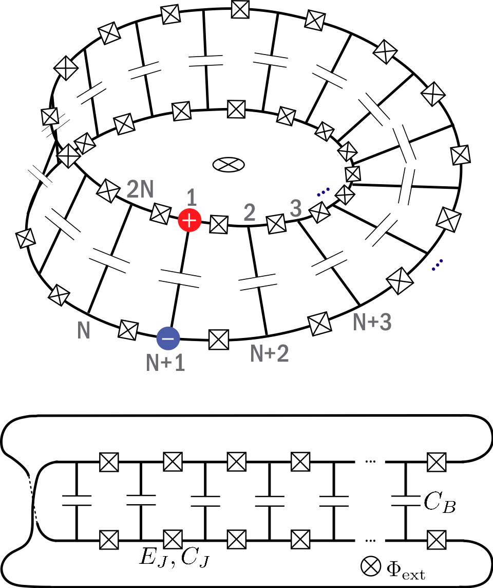

.. scqubits
   Copyright (C) 2017 and later, Jens Koch & Peter Groszkowski

Current Mirror
==============

The current-mirror qubit [Kitaev2006]_ is described by the Hamiltonian

.. math::
    
    H=&\sum_{i, j=1}^{2N-1}(n_{i}-n_{gi})4(E_\text{C})_{ij}(n_{j}-n_{gj}) \\
        -\sum_{i=1}^{2N-1}&E_{Ji}\cos\phi_{i}-E_{J2N}\cos(\sum_{i=1}^{2N-1}\phi_{i}+2\pi f),

where :math:`N` corresponds to the number of big capacitors, :math:`n_{gi}` the offset charge
associated with the :math:`i^{\text{th}}` degree of freedom, :math:`E_\text{C}` is the charging 
energy matrix and :math:`E_{Ji}` is the Josephson energy of the :math:`i^{\text{th}}` junction.
Each degree of freedom is represented in the charge basis, and we have performed
a coordinate transformation to eliminate the variable corresponding to the total charge on the circuit.

An instance of the current mirror is initialized as follows::

   N = 2
   ECB = 0.2
   ECJ = 20.0/2.7
   ECg = 20.0
   EJ = 20.0
   EJlist = np.array([EJ for _ in range(2*N)])
   nglist = np.array([0.0 for _ in range(2*N-1)])
   flux = 0.0
   current_mirror = qubit.CurrentMirror(N, ECB, ECJ, ECg, EJlist, nglist, flux, ncut=10, truncated_dim=6)

From within Jupyter notebook, a current mirror instance can alternatively be created with::

   current_mirror = scqubits.CurrentMirror.create()

This functionality is  enabled if the ``ipywidgets`` package is installed, and displays GUI forms prompting for
the entry of the required parameters.

Calculational methods related to Hamiltonian and energy spectra
---------------------------------------------------------------

.. autosummary::

    scqubits.CurrentMirror.hamiltonian
    scqubits.CurrentMirror.eigenvals
    scqubits.CurrentMirror.eigensys
    scqubits.CurrentMirror.get_spectrum_vs_paramvals

Implemented operators
---------------------

The following operators are implemented for use in matrix element calculations.

.. autosummary::
    scqubits.CurrentMirror.identity_operator
    scqubits.CurrentMirror.charge_number_operator
    scqubits.CurrentMirror.exp_i_phi_j_operator
    scqubits.CurrentMirror.exp_i_phi_boundary_term

Computation and visualization of matrix elements
------------------------------------------------

.. autosummary::

    scqubits.CurrentMirror.matrixelement_table
    scqubits.CurrentMirror.plot_matrixelements
    scqubits.CurrentMirror.get_matelements_vs_paramvals
    scqubits.CurrentMirror.plot_matelem_vs_paramvals

