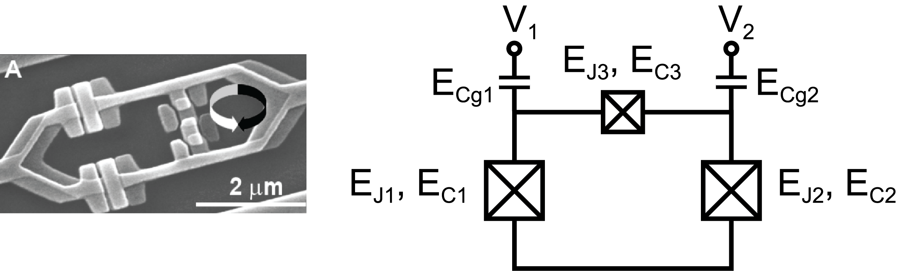

.. scqubits
   Copyright (C) 2017 and later, Jens Koch & Peter Groszkowski

Flux Qubit
==============

.. _qubit_flux_qubit:

The flux qubit [Orlando1999]_ is described by the Hamiltonian

.. math::

   H_\text{flux}=&(n_{i}-n_{gi})4(E_\text{C})_{ij}(n_{j}-n_{gj}) \\
                -&E_{J}\cos\phi_{1}-E_{J}\cos\phi_{2} \\
                -&\alpha E_{J}\cos(2\pi f + \phi_{1} - \phi_{2}),
                
where :math:`i,j \in \{1,2\}, E_\text{C}=\tfrac{e^2}{2}C^{-1}` and 

.. math::

   C = \left(\begin{matrix}
   C_{J1}+C_{g1}+C_{J3} & -C_{J3} \\
   -C_{J3} & C_{J2}+C_{g2}+C_{J3}
   \end{matrix}\right).
   
:math:`C_{Ji}` refers to the capacitance of the :math:`i^\text{th}` junction and :math:`C_{gi}` refers to the capacitance to ground of the :math:`i^\text{th}` island. For simplicity, the Hamiltonian is written here in a mixed basis, however for the purposes of numerical diagonalization in the ``FluxQubit`` class, the charge basis is employed for both variables. The user must specify a charge-number cutoff ``ncut``, chosen large enough so that convergence is achieved.

An instance of the flux qubit is initialized as follows::

   EJ = 35.0
   alpha = 0.6
   fluxqubit = scqubits.FluxQubit(EJ1 = EJ,
                                 EJ2 = EJ,
                                 EJ3 = alpha*EJ,
                                 ECJ1 = 1.0,
                                 ECJ2 = 1.0,
                                 ECJ3 = 1.0/alpha,
                                 ECg1 = 50.0,
                                 ECg2 = 50.0,
                                 ng1 = 0.0,
                                 ng2 = 0.0,
                                 flux = 0.5,
                                 ncut = 10)

From within Jupyter notebook, a flux qubit instance can alternatively be created with::

   fluxqubit = scqubits.FluxQubit.create()

This functionality is  enabled if the ``ipywidgets`` package is installed, and displays GUI forms prompting for
the entry of the required parameters.

Calculational methods related to Hamiltonian and energy spectra
---------------------------------------------------------------

.. autosummary::

    scqubits.FluxQubit.hamiltonian
    scqubits.FluxQubit.eigenvals
    scqubits.FluxQubit.eigensys
    scqubits.FluxQubit.get_spectrum_vs_paramvals

Wavefunctions and visualization of eigenstates and the potential
----------------------------------------------------------------

.. autosummary::

    scqubits.FluxQubit.wavefunction
    scqubits.FluxQubit.plot_wavefunction
    scqubits.FluxQubit.plot_potential

Implemented operators
---------------------

The following operators are implemented for use in matrix element calculations.

.. autosummary::
    scqubits.FluxQubit.n_1_operator
    scqubits.FluxQubit.n_2_operator
    scqubits.FluxQubit.exp_i_phi_1_operator
    scqubits.FluxQubit.exp_i_phi_2_operator
    scqubits.FluxQubit.cos_phi_1_operator
    scqubits.FluxQubit.cos_phi_2_operator
    scqubits.FluxQubit.sin_phi_1_operator
    scqubits.FluxQubit.sin_phi_2_operator

Computation and visualization of matrix elements
------------------------------------------------

.. autosummary::

    scqubits.FluxQubit.matrixelement_table
    scqubits.FluxQubit.plot_matrixelements
    scqubits.FluxQubit.get_matelements_vs_paramvals
    scqubits.FluxQubit.plot_matelem_vs_paramvals

