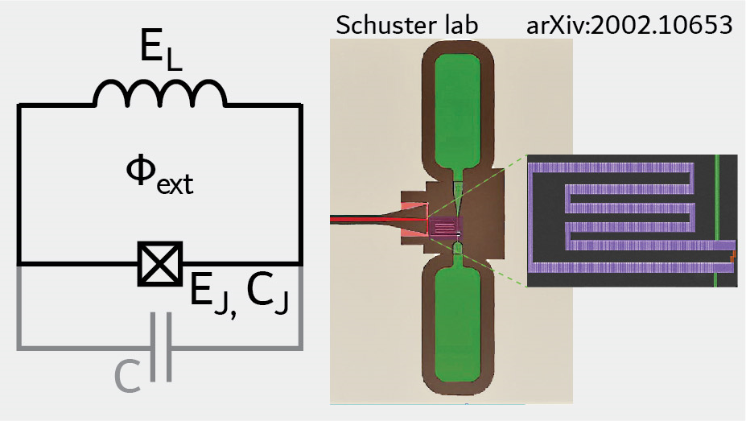

.. scqubits
   Copyright (C) 2017 and later, Jens Koch & Peter Groszkowski

Fluxonium Qubit
===============

The Hamiltonian of the fluxonium qubit [Manucharyan2009]_ in phase basis representation is given by

.. math::

   H=-4E_\text{C}\partial_\phi^2-E_\text{J}\cos(\phi-\varphi_\text{ext}) +\frac{1}{2}E_L\phi^2.

Here, :math:`E_C` is the charging energy, :math:`E_J` the Josephson energy, :math:`E_L` the inductive energy, and
:math:`\varphi_\text{ext}=2\pi \Phi_\text{ext}/\Phi_0` the external flux in dimensionless form. The ``Fluxonium`` class
internally uses the :math:`E_C`-:math:`E_L` harmonic-oscillator basis [Zhu2013]_ with truncation level specified by ``cutoff``.

An instance of the fluxonium created as follows::

   fluxonium = scqubits.Fluxonium(EJ = 8.9,
                                  EC = 2.5,
                                  EL = 0.5,
                                  flux = 0.33,
                                  cutoff = 110)

Here, ``flux`` is given in dimensionless units, in the form :math:`2\pi\Phi_\text{ext}/\Phi_0`.

From within Jupyter notebook, a fluxonium instance can alternatively be created with::

   fluxonium = scqubits.Fluxonium.create()

This functionality is  enabled if the ``ipywidgets`` package is installed, and displays GUI forms prompting for
the entry of the required parameters.

Calculational methods related to Hamiltonian and energy spectra
---------------------------------------------------------------

.. autosummary::

    scqubits.Fluxonium.hamiltonian
    scqubits.Fluxonium.eigenvals
    scqubits.Fluxonium.eigensys
    scqubits.Fluxonium.get_spectrum_vs_paramvals

Wavefunctions and visualization of eigenstates
----------------------------------------------

.. autosummary::

    scqubits.Fluxonium.wavefunction
    scqubits.Fluxonium.plot_wavefunction

Implemented operators
---------------------

The following operators are implemented for use in matrix element calculations.

.. autosummary::
    scqubits.Fluxonium.n_operator
    scqubits.Fluxonium.phi_operator
    scqubits.Fluxonium.exp_i_phi_operator
    scqubits.Fluxonium.cos_phi_operator
    scqubits.Fluxonium.sin_phi_operator

Computation and visualization of matrix elements
------------------------------------------------

.. autosummary::

    scqubits.Fluxonium.matrixelement_table
    scqubits.Fluxonium.plot_matrixelements
    scqubits.Fluxonium.get_matelements_vs_paramvals
    scqubits.Fluxonium.plot_matelem_vs_paramvals

