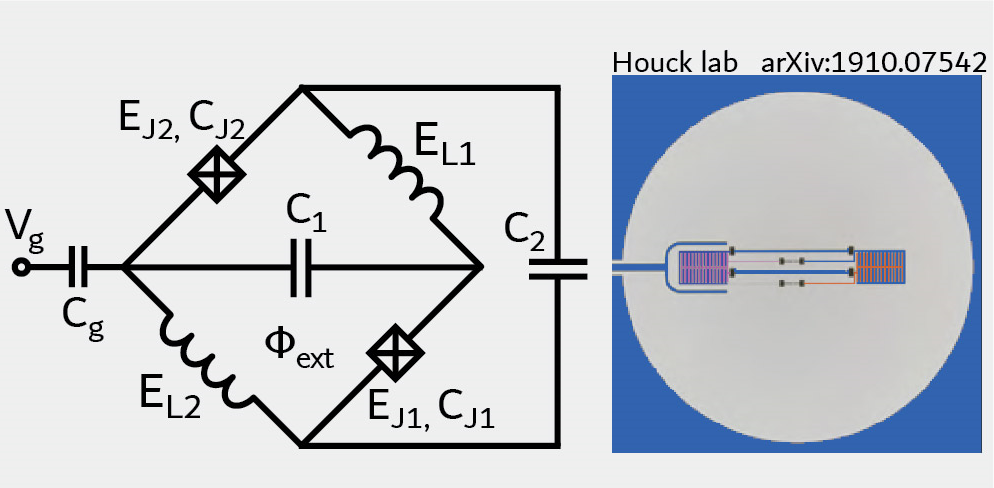

.. scqubits
   Copyright (C) 2017 and later, Jens Koch & Peter Groszkowski

.. _qubit_fullzeropi:

Full Zero-Pi Qubit  (incl. coupling to zeta mode)
=================================================

The full Zero-Pi qubit [Brooks2013]_ [Dempster2014]_, when including coupling to the zeta mode, is described by the
Hamiltonian :math:`H = H_{0-\pi} + H_\text{int} + H_\zeta`, where

.. math::
   &H_{0-\pi} = -2E_\text{CJ}\partial_\phi^2+2E_{\text{C}\Sigma}(i\partial_\theta-n_g)^2 +2E_{C\Sigma}dC_J\,\partial_\phi\partial_\theta\\
   &\qquad\qquad\qquad+2E_{C\Sigma}(\delta C_J/C_J)\partial_\phi\partial_\theta +2\,\delta E_J \sin\theta\sin(\phi-\phi_\text{ext}/2)\\
   &H_\text{int} = 2E_{C\Sigma}dC\,\partial_\theta\partial_\zeta + E_L dE_L \phi\,\zeta\\
   &H_\zeta = \omega_\zeta a^\dagger a

expressed in phase basis. The definition of the relevant charging energies :math:`E_\text{CJ}`, :math:`E_{\text{C}\Sigma}`,
Josephson energies :math:`E_\text{J}`, inductive energies :math:`E_\text{L}`, and relative amounts of disorder
:math:`dC_\text{J}`, :math:`dE_\text{J}`, :math:`dC`, :math:`dE_\text{L}` follows [Groszkowski2018]_.
Internally, the ``FullZeroPi`` class formulates the Hamiltonian matrix via the product basis of the decoupled Zero-Pi
qubit (realized by ``ZeroPi``)  on one hand, and the zeta LC oscillator on the other hand.

An instance of the full Zero-Pi qubit is created as follows::

   phi_grid = scqubits.Grid1d(-6*np.pi, 6*np.pi, 200)

   zero_pi = scqubits.FullZeroPi(grid = phi_grid,
                                EJ   = 0.25,
                                EL   = 10.0**(-2),
                                ECJ  = 0.5,
                                EC   = 0.001,
                                dEJ  = 0.05,
                                dCJ  = 0.05,
                                dEL  = 0.01,
                                dC   = 0.08,
                                ng   = 0.1,
                                flux = 0.23,
                                ncut = 30,
                                zeropi_cutoff = 10,
                                zeta_cutoff = 30)

Here, ``flux`` is given in in terms of the flux quantum, i.e., in the form :math:`\Phi_\text{ext}/\Phi_0`. In the above example,
the disorder parameters ``dEJ`` and ``dCJ`` are not specified, and hence take on the default value zero (no disorder).

From within Jupyter notebook, an instance of the disordered Zero-Pi qubit can alternatively be created with::

   zero_pi = scqubits.ZeroPiFull.create()

This functionality is  enabled if the ``ipywidgets`` package is installed, and displays GUI forms prompting for
the entry of the required parameters.

Calculational methods related to Hamiltonian and energy spectra
---------------------------------------------------------------

.. autosummary::

    scqubits.FullZeroPi.hamiltonian
    scqubits.FullZeroPi.eigenvals
    scqubits.FullZeroPi.eigensys
    scqubits.FullZeroPi.get_spectrum_vs_paramvals

Wavefunctions and visualization of eigenstates
----------------------------------------------

.. todo:: consider adding this?

Implemented operators
---------------------

The following operators are implemented for use in matrix element calculations.

.. autosummary::

    scqubits.FullZeroPi.i_d_dphi_operator
    scqubits.FullZeroPi.phi_operator
    scqubits.FullZeroPi.n_theta_operator

.. todo:: may want to implement additional ops

Computation and visualization of matrix elements
------------------------------------------------

.. autosummary::

    scqubits.FullZeroPi.matrixelement_table
    scqubits.FullZeroPi.plot_matrixelements
    scqubits.FullZeroPi.get_matelements_vs_paramvals
    scqubits.FullZeroPi.plot_matelem_vs_paramvals
    scqubits.FullZeroPi.g_coupling_matrix
    scqubits.FullZeroPi.g_phi_coupling_matrix
    scqubits.FullZeroPi.g_theta_coupling_matrix

Utility method for setting charging energies
--------------------------------------------

.. autosummary::

    scqubits.ZeroPi.set_EC_via_ECS
