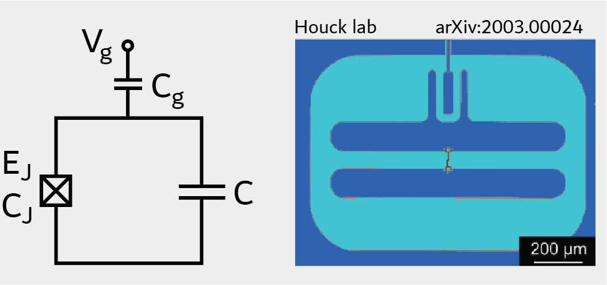

.. scqubits
   Copyright (C) 2017 and later, Jens Koch & Peter Groszkowski

.. _qubit_transmon:

Transmon Qubit
==============

The transmon qubit [Koch2007]_ is described by the Hamiltonian

.. math::

   H=4E_\text{C}(\hat{n}-n_g)^2+\frac{1}{2}E_\text{J}\sum_n(|n\rangle\langle n+1|+\text{h.c.}),

expressed in discrete charge basis. :math:`E_C` is the charging energy, :math:`E_J` the Josephson energy, and
:math:`n_g` the offset charge. Within the ``Transmon`` class, charge-basis representation is employed with a
charge-number cutoff specified by ``ncut``. This cutoff must be chosen sufficiently large for convergence.

An instance of the transmon qubit is initialized as follows::

   transmon = scqubits.Transmon(EJ=30.02,
                                 EC=1.2,
                                 ng=0.3,
                                 ncut=31)

From within Jupyter notebook, a transmon instance can alternatively be created with::

   transmon = scqubits.Transmon.create()

This functionality is  enabled if the ``ipywidgets`` package is installed, and displays GUI forms prompting for
the entry of the required parameters.

Calculational methods related to Hamiltonian and energy spectra
---------------------------------------------------------------

.. autosummary::

    scqubits.Transmon.hamiltonian
    scqubits.Transmon.eigenvals
    scqubits.Transmon.eigensys
    scqubits.Transmon.get_spectrum_vs_paramvals

Wavefunctions and visualization of eigenstates
----------------------------------------------

.. autosummary::

    scqubits.Transmon.numberbasis_wavefunction
    scqubits.Transmon.wavefunction
    scqubits.Transmon.plot_n_wavefunction
    scqubits.Transmon.plot_phi_wavefunction

Implemented operators
---------------------

The following operators are implemented for use in matrix element calculations.

.. autosummary::
    scqubits.Transmon.n_operator
    scqubits.Transmon.exp_i_phi_operator
    scqubits.Transmon.cos_phi_operator
    scqubits.Transmon.sin_phi_operator

Computation and visualization of matrix elements
------------------------------------------------

.. autosummary::

    scqubits.Transmon.matrixelement_table
    scqubits.Transmon.plot_matrixelements
    scqubits.Transmon.get_matelements_vs_paramvals
    scqubits.Transmon.plot_matelem_vs_paramvals

