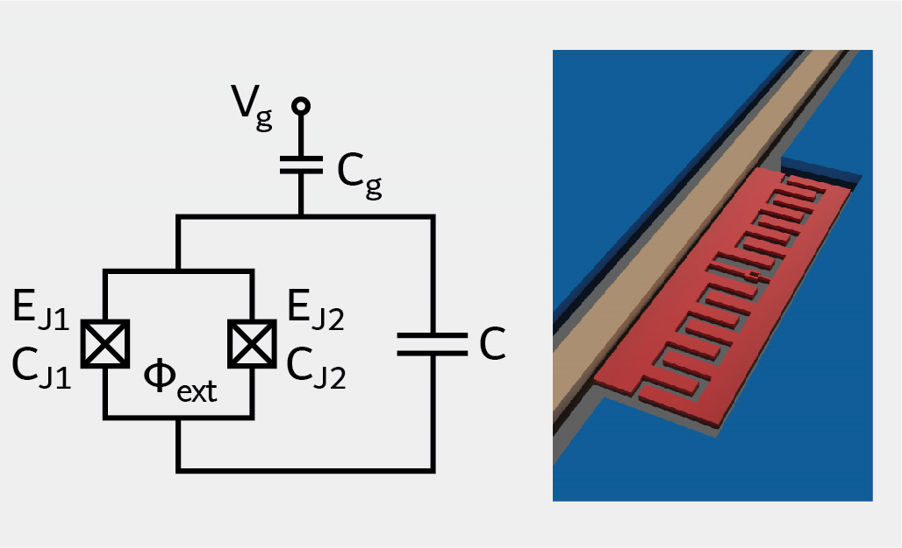

.. scqubits
   Copyright (C) 2017 and later, Jens Koch & Peter Groszkowski

Tunable Transmon Qubit
======================

The flux-tunable transmon qubit [Koch2007]_ is a simple modification of the fixed-frequency transmon obtained by
replacing the Josephson junction by a SQUID loop of two Josephson junctions. A flux threaded through this loop can
then be used to change the effective Josephson energy of the circuit and thus make the transmon tunable.

.. math::

   H = 4E_\text{C}(\hat{n}-n_g)^2+\frac{1}{2}E_\text{J,eff}(\Phi_\text{ext})\sum_n(|n\rangle\langle n+1|+\text{h.c.}),

expressed in the charge basis. Here, the parameters are those of the fixed-frequency transmon except for the effective
Josephson energy
:math:`E_\text{J,eff}(\Phi_\text{ext}) = E_{\text{J,max}} \sqrt{\cos^2(\pi\Phi_\text{ext}/\Phi_0)+ d^2 \sin^2 (\pi\Phi_\text{ext}/\Phi_0)}`,
where :math:`E_\text{J,max} = E_\text{J1} + E_\text{J2}` is the maximum Josephson energy, and
:math:`d=(E_\text{J1}-E_\text{J2})/(E_\text{J1}+E_\text{J2})`
is the relative junction asymmetry.

An instance of a tunable transmon qubit is created like this::

   tune_tmon = scqubits.TunableTransmon(
      EJmax=50.0,
      EC=0.5,
      d=0.01,
      flux=0.0,
      ng=0.0,
      ncut=30
   )

From within Jupyter notebook, a GUI-based creation is supported via::

   tune_tmon = scqubits.TunableTransmon.create()

This functionality is  enabled if the ``ipywidgets`` package is installed, and displays GUI forms prompting for
the entry of the required parameters.

Calculational methods related to Hamiltonian and energy spectra
---------------------------------------------------------------

.. autosummary::

    scqubits.TunableTransmon.hamiltonian
    scqubits.TunableTransmon.eigenvals
    scqubits.TunableTransmon.eigensys
    scqubits.TunableTransmon.get_spectrum_vs_paramvals

Wavefunctions and visualization of eigenstates
----------------------------------------------

.. autosummary::

    scqubits.TunableTransmon.numberbasis_wavefunction
    scqubits.TunableTransmon.wavefunction
    scqubits.TunableTransmon.plot_n_wavefunction
    scqubits.TunableTransmon.plot_phi_wavefunction

Implemented operators
---------------------

The following operators are implemented for use in matrix element calculations.

.. autosummary::
    scqubits.TunableTransmon.n_operator
    scqubits.TunableTransmon.exp_i_phi_operator
    scqubits.TunableTransmon.cos_phi_operator
    scqubits.TunableTransmon.sin_phi_operator
Tunable

Computation and visualization of matrix elements
------------------------------------------------

.. autosummary::

    scqubits.TunableTransmon.matrixelement_table
    scqubits.TunableTransmon.plot_matrixelements
    scqubits.TunableTransmon.get_matelements_vs_paramvals
    scqubits.TunableTransmon.plot_matelem_vs_paramvals

