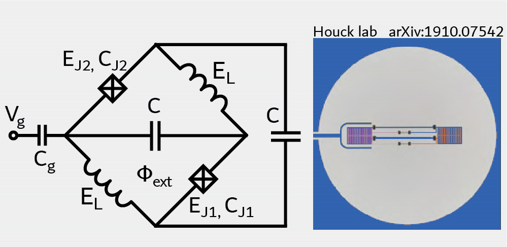

.. scqubits
   Copyright (C) 2017 and later, Jens Koch & Peter Groszkowski

Zero-Pi Qubit  (decoupled from zeta mode)
=========================================

The Zero-Pi qubit [Brooks2013]_ [Dempster2014]_, when decoupled from the zeta mode, is described by the Hamiltonian

.. math::

   H &= -2E_\text{CJ}\partial_\phi^2+2E_{\text{C}\Sigma}(i\partial_\theta-n_g)^2
    +2E_{C\Sigma}dC_J\,\partial_\phi\partial_\theta\\
     &\qquad -2E_\text{J}\cos\theta\cos(\phi-\varphi_\text{ext}/2)+E_L\phi^2+2E_\text{J}
    + E_J dE_J \sin\theta\sin(\phi-\varphi_\text{ext}/2)

expressed in phase basis. The definition of the relevant charging energies :math:`E_\text{CJ}`, :math:`E_{\text{C}\Sigma}`,
Josephson energies :math:`E_\text{J}`, inductive energies :math:`E_\text{L}`, and relative amounts of disorder
:math:`dC_\text{J}`, :math:`dE_\text{J}` follows [Groszkowski2018]_.

Internally, the ``ZeroPi`` class formulates the Hamiltonian matrix by discretizing the ``phi`` variable, and
using charge basis for the ``theta`` variable.

An instance of the Zero-Pi qubit is created as follows::

   phi_grid = scqubits.Grid1d(-6*np.pi, 6*np.pi, 200)

   zero_pi = scqubits.ZeroPi(grid = phi_grid,
                              EJ   = 0.25,
                              EL   = 10.0**(-2),
                              ECJ  = 0.5,
                              EC   = None,
                              ECS  = 10.0**(-3),
                              ng   = 0.1,
                              flux = 0.23,
                              ncut = 30)

Here, ``flux`` is given in units of the flux quantum, i.e., in the form :math:`\Phi_\text{ext}/\Phi_0`. In the above example,
the disorder parameters ``dEJ`` and ``dCJ`` are not specified, and hence take on the default value zero (no disorder).

From within Jupyter notebook, a fluxonium instance can alternatively be created with::

   zero_pi = scqubits.ZeroPi.create()

This functionality is  enabled if the ``ipywidgets`` package is installed, and displays GUI forms prompting for
the entry of the required parameters.

Calculational methods related to Hamiltonian and energy spectra
---------------------------------------------------------------

.. autosummary::

    scqubits.ZeroPi.hamiltonian
    scqubits.ZeroPi.eigenvals
    scqubits.ZeroPi.eigensys
    scqubits.ZeroPi.get_spectrum_vs_paramvals

Wavefunctions and visualization of eigenstates
----------------------------------------------

.. autosummary::

    scqubits.ZeroPi.wavefunction
    scqubits.ZeroPi.plot_wavefunction

Implemented operators
---------------------

The following operators are implemented for use in matrix element calculations.

.. autosummary::
    scqubits.ZeroPi.i_d_dphi_operator
    scqubits.ZeroPi.phi_operator
    scqubits.ZeroPi.n_theta_operator
    scqubits.ZeroPi.cos_theta_operator
    scqubits.ZeroPi.sin_theta_operator

Computation and visualization of matrix elements
------------------------------------------------

.. autosummary::

    scqubits.ZeroPi.matrixelement_table
    scqubits.ZeroPi.plot_matrixelements
    scqubits.ZeroPi.get_matelements_vs_paramvals
    scqubits.ZeroPi.plot_matelem_vs_paramvals

Utility method for setting charging energies
--------------------------------------------

.. autosummary::

    scqubits.ZeroPi.set_EC_via_ECS

