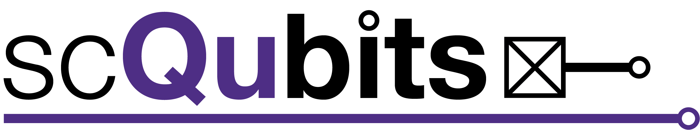

.. scqubits
   Copyright (C) 2019, Jens Koch & Peter Groszkowski

Superconducting Qubits in Python
===========================================

   scqubits is an open-source Python library for simulating superconducting qubits. It is meant to give the user a
   convenient way to obtain energy spectra of common superconducting qubits, plot energy levels as a function of external
   parameters, calculate matrix elements etc. The library further provides an interface to QuTiP, making it easy to work
   with composite Hilbert spaces consisting of coupled superconducting qubits and harmonic modes. Internally, numerics
   is carried out with the help of Numpy and Scipy; plotting capabilities rely on Matplotlib.

.. toctree::
   :maxdepth: 2

   installation.rst
   guide/guide.rst
   api-doc/apidoc.rst
   changelog.rst
   contributors.rst
   acknowledgments.rst
   bibliography.rst

Indices and tables
====================

* :ref:`genindex`
* :ref:`modindex`
* :ref:`search`